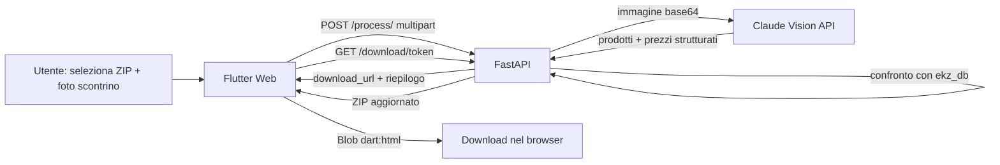

# Lista della Spesa — Aggiorna Spesa da Scontrino

**Aggiorna Spesa da Scontrino** è il sistema che permette di fotografare uno
scontrino della spesa e aggiornare automaticamente l'archivio prezzi
(backup ZIP dell'app di gestione lista della spesa) senza inserimento
manuale: la foto viene letta da un modello Claude, i prodotti estratti
vengono confrontati con l'archivio esistente e il backup ZIP aggiornato è
pronto per essere riscaricato.

## Panoramica dei componenti

| Livello | Tecnologia | Cartella |
|---|---|---|
| Frontend | Flutter Web | [`App_AndroFlutter/`](https://github.com/fabiomoro7618/Lista-della-spesa/tree/main/App_AndroFlutter) |
| Backend | Python · FastAPI · Uvicorn | [`App_Python/`](https://github.com/fabiomoro7618/Lista-della-spesa/tree/main/App_Python) |
| AI / OCR | Claude API (Anthropic) | chiamato da `App_Python/main.py` |
| Client desktop di riferimento | Unity (ReceiptManagerUI) | [`App_Unity/`](https://github.com/fabiomoro7618/Lista-della-spesa/tree/main/App_Unity) |

## Funzionalità chiave

- **Upload doppio**: selezione del backup ZIP esistente (`.zip`) e della foto
  dello scontrino direttamente dal browser, tramite `file_picker` — nessun
  filesystem reale richiesto (funziona identicamente su Web e desktop).
- **Estrazione automatica** di nome prodotto e prezzo dallo scontrino tramite
  Claude Vision, con output strutturato (schema JSON garantito, niente
  parsing manuale di testo libero).
- **Sincronizzazione intelligente** con l'archivio SQLite (`ekz_db`)
  contenuto nello ZIP: aggiorna il prezzo solo se quello nuovo è più basso (o
  se il prodotto non aveva ancora un prezzo), inserisce i prodotti nuovi,
  lascia invariati gli altri.
- **Riepilogo interattivo** in Flutter con schede Aggiornati / Aggiunti /
  Invariati, dettaglio dei risparmi ottenuti e sezione espandibile per i
  prodotti invariati.
- **Download diretto del backup aggiornato** nel browser, senza passare da
  API native di sistema (vedi [Flutter Web UI](flutter_web.md)).

## Prerequisiti

Per eseguire il progetto in locale o in un Codespace servono:

- **Python 3.12+** con `fastapi`, `uvicorn`, `anthropic`, `python-dotenv`
  installati (vedi [Architettura & Backend](architettura.md)).
- Una **`ANTHROPIC_API_KEY`** valida, impostata in `App_Python/.env`
  (file escluso da Git tramite `.gitignore`).
- **Flutter SDK** (canale stable) per compilare la UI Web
  (`flutter build web --release`).
- Se eseguito in **GitHub Codespaces**: le porte `8000` (backend) e `8080`
  (frontend) devono essere impostate come `public` per essere raggiungibili
  dal browser — vedi [Guida Riavvio Server](guida_server.md).

## Flusso ad alto livello

Per il dettaglio di ogni passaggio, consulta
[Architettura & Backend](architettura.md) e [Flutter Web UI](flutter_web.md).
